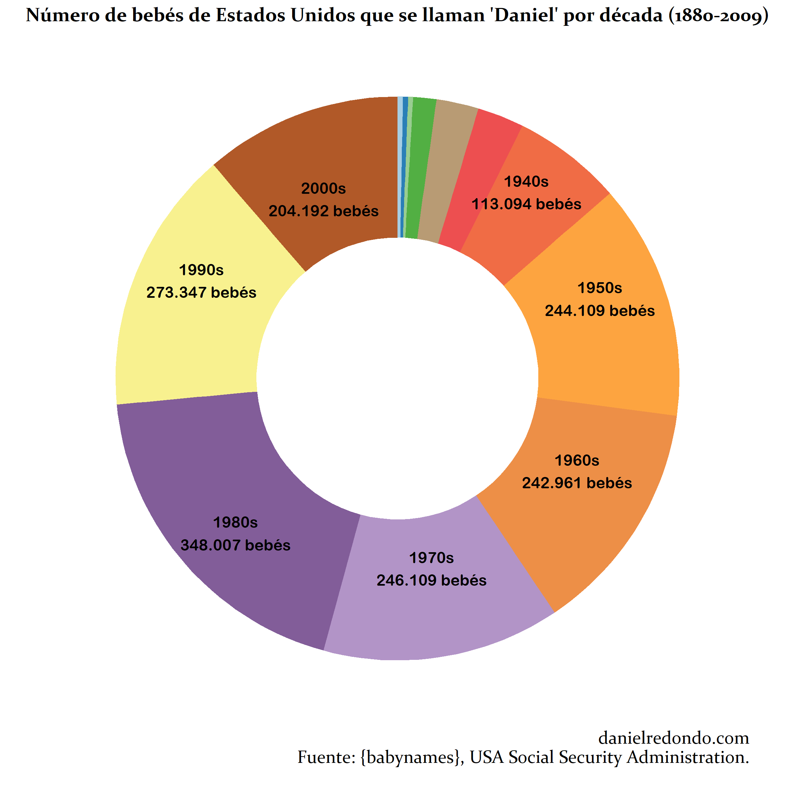

# #30díasdegráficos

#30díasdegráficos con R es una iniciativa de [R4ds en español](https://github.com/cienciadedatos/datos-de-miercoles/blob/master/30-dias-de-graficos-2020.md) para conmemorar el nacimiento de Florence Nightingale, referente femenina de la visualización de datos. En el desafío, se propone crear un gráfico distinto al día, y compartir el código.

### Día 1. Gráfico de barras

Histograma del índice de masa corporal en adultos, según la Encuesta Nacional de Salud de 2017. [Código](scripts/01_barras.R).

### Día 2. Gráfico de líneas

Número de visitas diarias a la página de R en Wikipedia en español desde 2018. [Código](scripts/02_lineas.R).

### Día 3. Gráfico de puntos/burbujas

Distribución de los premios de lotería de 2018. [Código](scripts/03_burbujas.R).

### Día 4. Gráfico con facetas

Relación entre estadísticas de ataque y defensa según tipo de Pokémon. [Código](scripts/04_facetas.R).

### Día 5. Gráfico de arco

Relaciones entre los personajes de la casa Lannister durante la primera temporada de Juego de Tronos. [Código](scripts/05_arco.R).

### Día 6. Gráfico de donut :doughnut:

Número de bebés de Estados Unidos que se llaman "Daniel" por década (1880-2009). [Código](scripts/06_donut.R).

### Día 7. Gráfico ridgeline

Relieve de la provincia de Granada. [Código](scripts/07_ridgeline.R).

### Día 8. Gráfico de contorno

Imitación de la portada del disco "[Super 8](https://m.eldiario.es/fotos/Portada-disco-Super_EDIIMA20190503_0693_5.jpg)" de Los Planetas. [Código](scripts/08_contorno.R).

### Día 9. Áreas apiladas

Distribución por género de los comités de las Jornadas de Usuarios de R en España. [Código](scripts/09_areas_apiladas.R).

### Día 10. Paletas de colores

Atractores coloreados con una paleta de colores basada en la película "El Gran Hotel Budapest" de Wes Anderson. [Código](scripts/10_paleta_colores.R).

### Día 11. Mapa de calor

Comorbilidades por grupos de edad en pacientes de cáncer colorrectal. Extraído de [este artículo](https://www.dovepress.com/multimorbidity-by-patient-and-tumor-factors-and-time-to-surgery-among--peer-reviewed-article-CLEP). [Código](scripts/11_heatmap.R).

### Día 12. Gráfico de piruleta

Puntuación en IMDb de las películas de Pedro Almodóvar. [Código](scripts/12_lollipop.R).

### Día 13. Gráfico de piruleta

Defunciones diarias por coronavirus en España. [Código](scripts/13_tiempo.R).

### Día 14. Gráfico de rectángulos

Duración de las canciones del disco "La ley innata" de Extremoduro. [Código](scripts/14_treemap.R).

### Día 15. Dendrograma (treemap)

Jugadores de Real Madrid y Granada, con clustering jerárquico (k = 2) en base a media y potencial en FIFA 20. [Código](scripts/15_dendrograma.R).

### Día 16. Gráfico de waffle :waffle:

Número de veces que se menciona a Nairobi por capítulo en la serie La Casa de Papel. En [este hilo de Twitter](https://twitter.com/dredondosanchez/status/1265689410466652166) hay más personajes. [Código](scripts/16_waffle.R).

### Día 17. Diagrama de Sankey

Presupuestos Generales del Estado (España, 2019) según tipos de política. [Código](scripts/17_sankey.R).

### Día 18. Datos espaciales

Mapa de Granada capital con calles y ríos. [Código](scripts/18_mapa.R).

### Día 19. Stream graph

COVID-19: Casos y defunciones diarias en España. [Código](scripts/19_stream.R).

### Día 20. Red

Gráfico acíclico dirigido sobre la pandemia de COVID-19. [Código](scripts/20_red.R).

### Día 21. Gráfico con anotaciones

Relación goles/partido en La Liga 19-20. Etiquetados los 10 jugadores con mayor proporción goles/partido y más de 5 partidos jugados. [Código](scripts/21_anotaciones.R).

### Día 22. Datos textuales

Nube de palabras del "Romancero Gitano" de Federico García Lorca, con las 100 palabras más frecuentes. [Código](scripts/22_texto.R).

### Día 23. Gráficos de proyección solar (*sunburst*)

*The Office*: Distribución de frases por temporadas y personajes principales (Michael, Dwight, Jim, Pam, Andy). [Código](scripts/23_sunburst.R).

### Día 24. Coropletas

Mapa de privación en España por sección censal (2011). [Código](scripts/24_coropletas.R).

### Día 25. Gráfico de violin

Altura por sexos en España. [Código](scripts/25_violin.R).

